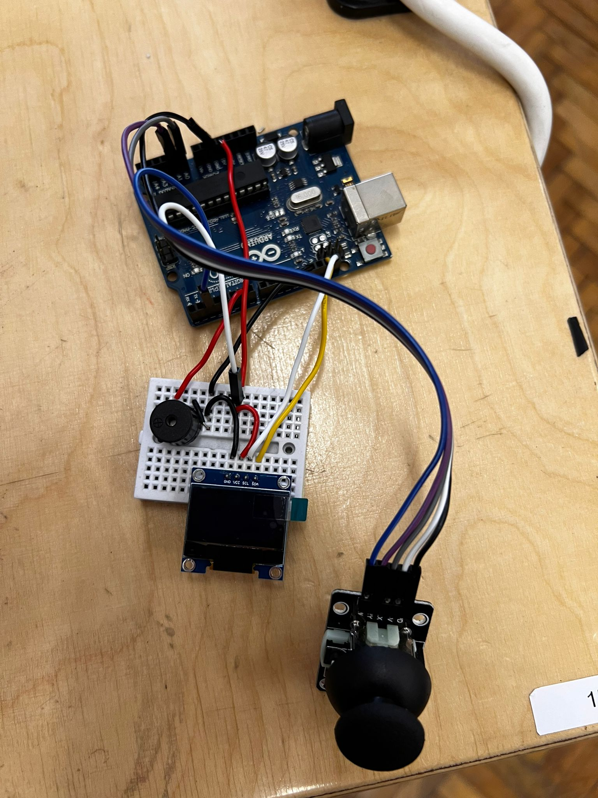

# Flappy Bird

## Introduction
**Flappy Bird** is a classic mobile game where players control the upward movement of a bird navigating through a series of obstacles. These obstacles consist of pairs of vertically aligned pipes with a gap between them, positioned against a scrolling landscape. The objective is to avoid collisions with the pipes or the edges of the screen. Each successful passage through a pair of pipes increases the player's score and gradually accelerates the game's speed, making it increasingly challenging as the game progresses.

## General Description

### Project Status
    The project is very close to being done, both hardware and software wise. The software part still has a bug with the second submenu, but the implementation of the game logic, graphics, interactions, and menu is complete.
### Modules and Components
- **Arduino**: The main microcontroller that manages all components and game logic.
- **Small Breadboard**: Used to connect and organize the hardware components.
- **OLED IIC 0.96" 128x64 Y&B**: The OLED screen for displaying the game graphics.
- **Buzzer**: Used to generate sounds during the game.
- **JoyStick**: Used to control the bird's movement in the game.
- **Wires**: Connect all components to the Arduino.

### Connection Interfaces
- **OLED IIC 0.96" 128x64 Y&B**: Connected to the Arduino via the I2C interface (SDA and SCL).
- **Buzzer**: Connected to a digital pin on the Arduino to generate sounds.
- **JoyStick**: Connected to the analog pins on the Arduino to read the joystick's position and GPIO PIN 2 with interrupt capabilities for the joystick button.

### Communication Specifications
- **I2C**: Used for communication with the OLED screen. This interface uses two communication lines (SDA and SCL) and allows high-speed data transfer.
- **Analog**: Used for reading the joystick's position. The Arduino converts the analog signal into digital values to determine the direction of movement.
- **Interrupts**: Used for reading the joystick's button press. The Arduino's interrupt pin (e.g., PIN 2) is configured to detect the button press, triggering an interrupt service routine when the button is pressed.
- **Pulse Width Modulation**: Used for playing the buzzer. The Arduino's PWM pin (e.g., PIN 6) is configured to send a variable signal to the anode of the buzzer, which will play distinct sounds based on the duty cycle of the PWM signal.

### Processing and Calculations
- **Arduino**: The Arduino processor handles all the necessary calculations for the game logic, including collision detection and score updates.
- **Power Consumption**: The power consumption is minimal, as most components are low-power. The OLED screen and buzzer are the main power consumers, but they are efficiently managed by the Arduino.

## Hardware Design
| Components  | Pieces |
| ----------------------- | -- |
| Arduino                 | 1  |
| Small Breadboard        | 1  |
|OLED IIC 0.96" 128x64 Y&B| 1  |
|Buzzer                   | 1  |
|JoyStick                 | 1  |
|Wires                    |    |

## Software Design

### Development Environment
For developing the Flappy Bird application on Arduino, I used PlatformIO in Visual Studio Code. It provides a powerful and efficient environment for writing, compiling, and uploading code to the Arduino microcontroller.

### Libraries and 3rd-Party Sources Used
- `Arduino.h`: This core library provides the fundamental functions and definitions for Arduino sketches, such as `setup()`, `loop()`, digital and analog I/O operations, and timing functions. It's essential for any Arduino project.

- `Adafruit_SSD1306.h`: I used this library to control the SSD1306-based OLED display. It provides functions to initialize the display, draw pixels, lines, shapes, and text, and manage the display buffer. It's crucial for rendering the game's graphics.

- `SPI.h`: This library facilitates communication with devices using the Serial Peripheral Interface (SPI) protocol. I used it for high-speed data transfer between the Arduino and peripherals like displays or sensors.

- `Wire.h`: This library is used for I2C communication. It allows the Arduino to communicate with I2C devices, such as the SSD1306 OLED display. It's essential for sending and receiving data over the I2C bus.

- `Adafruit_GFX.h`: This is a graphics library that works with many different displays, including the SSD1306. It provides functions for drawing shapes, text, and bitmaps, which are essential for creating the visual elements of the game.

- `avr/pgmspace.h`: I used this library to store data in the flash memory of AVR microcontrollers. It helps in saving RAM by storing constant data (like images or text) in the program memory. This is particularly useful for storing bitmap graphics and melodies in the project.

- `avr/interrupt.h`: This library is used to handle interrupts in AVR microcontrollers. It allows me to define interrupt service routines (ISRs) that can respond to hardware events, such as button presses or timer overflows. This is used in the project to handle button presses and timer-based events for the game logic and melody playback.

### Algorithms and Structures Planned for Implementation
- **Start Screen and Game Over Screen:**
    - The start screen appears only when the Arduino is started.
    - The game over screen appears each time the player loses, displaying the total score for that round.
- **Main Menu:**
    - Accessed by pressing the joystick's button.
    - To exit, press the button again.
    - To go back in the main menu without changing anything press the button again.
    - Up/Down navigation using the joystick.
    - Move the joystick to the left to scroll in the submenu and to the right to select a submenu to the main menu.
    - It has 3 submenus which are:
        - Difficulty
        - Character selection
        - Music ON/OFF
- **Gameplay:**
    - Bird's movement is controlled by sliding the joystick upwards.
    - Collision detection ensures the bird can't hit any edges of the screen or the pair of pipes.
    - Pipes generation: the gap's coordinates are random.
    - Difficulty: changes the speed of the bird (moving faster from the start of the game) as well as the gap size between the pairs of pipes.
- **Music:**
    - Plays only one song, with predefined notes and melody.
- **Hardware:**
    - The OLED screen displays the graphics.
    - The joystick is used for navigation.
    - The buzzer is used for playing the music.

### Sources and Functions Implemented
- **consts.h and consts.cpp**: Contain variables and data stored in the flash memory of the microcontroller, because the RAM wouldn't be enough.
- **game_config.h**: Contains the declaration of global variables allowing them to be imported in the rest of the library.
- **game_logic.h and game_logic.cpp**: Contain functions for the game logic, including `checkCollision()`, `gameLogic()`, and `setupGame()`.
- **graphics.h and graphics.cpp**: Contain functions for rendering the game's graphics, including `drawBitmap()`, `animateFlappyBird()`, `drawGround()`, `drawObstacle()`, and functions for drawing menus and difficulty screens.
- **melody.h and melody.cpp**: Contain functions for playing melodies and sounds in the game, including `playMelody()` and `playJumpSound()`.
- **main.cpp**: Contains the main functions of the game, including `setup()`, `loop()`, `menu()`, and `menuLogic()`, as well as handling joystick and button inputs.

These modules and functions work together to create a complete and interactive gaming experience on the Arduino platform.
## Results 

## Conclusions
### Applied Laboratory Notions In My Project
- **Pulse Width Modulation (PWM):**
    - PWM was used to control the buzzer, allowing different tones to be played and create a song.
- **I2C:**
    - I2C was used to communicate with the OLED screen through the Adafruit_SSD1306.h library.
- **Interrupt:**
    - The interrupt was used on the joystick's button to access the main menu, which also calls the specific function and pauses the game.
- **ADC:**
    - The ADC was used for the joystick's controller, as it provides a variable voltage using a variable resistor.
## Journal
- **Updated README 13/12/2024:**
    - Added **General Description:**
        - Block Scheme
        - Description to further clarify the Block Scheme
    - Added **Hardware Design:**
        - Table containing the components and pieces
        - Electrical Diagram
        - Hardware Diagram with Wokwi
    - Added **Bibliography/Other**
- **Update README 7/1/2025:**
    - Added **Source Files For Software Functionalities**
    - Added **Youtube Embeded Link**
    - Added **Hardware Picture**
    - Updated **Conclusions**
    - Updated **Results**

## Bibliography/Other resources
### Hardware
---------------
> [Oled Screen Tutorial](https://lastminuteengineers.com/oled-display-arduino-tutorial/) \
> [JoyStick Arduino Tutorial](https://arduinogetstarted.com/tutorials/arduino-joystick) 

### Software
---------------
> [Image BitMap Converter](https://javl.github.io/image2cpp/) \
> [Image BitMap And Menu](https://github.com/upiir/arduino_oled_menu?tab=readme-ov-file) \
> [Editor Used For Menu Images](https://www.photopea.com/) \
> [8x8 Matrix For Character Editor](https://xantorohara.github.io/led-matrix-editor/#) \
> [Buzzer](https://github.com/robsoncouto/arduino-songs/blob/master/takeonme/takeonme.ino)
