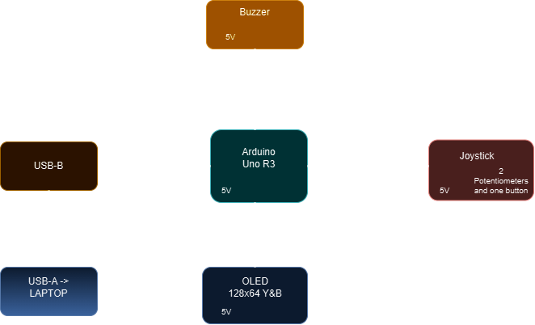
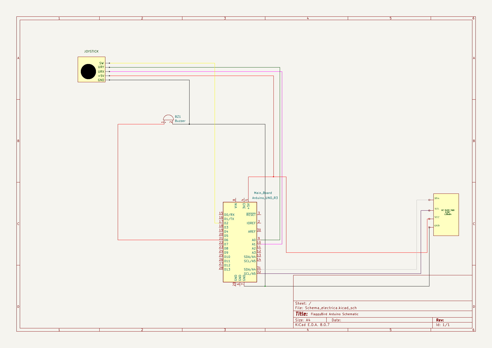
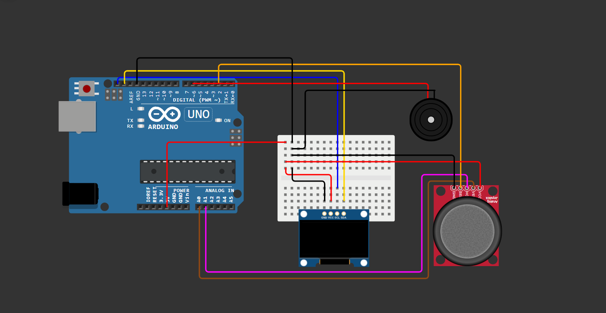

# Flappy Bird

## Introduction
**Flappy Bird** is a classic mobile game where players control the upward movement of a bird navigating through a series of obstacles. These obstacles consist of pairs of vertically aligned pipes with a gap between them, positioned against a scrolling landscape. The objective is to avoid collisions with the pipes or the edges of the screen. Each successful passage through a pair of pipes increases the player's score and gradually accelerates the game's speed, making it increasingly challenging as the game progresses.

## General Description

### Modules and Components
- **Arduino**: The main microcontroller that manages all components and game logic.
- **Small Breadboard**: Used to connect and organize the hardware components.
- **OLED IIC 0.96" 128x64 Y&B**: The OLED screen for displaying the game graphics.
- **Buzzer**: Used to generate sounds during the game.
- **JoyStick**: Used to control the bird's movement in the game.
- **Wires**: Connect all components to the Arduino.

### Connection Interfaces
- **OLED IIC 0.96" 128x64 Y&B**: Connected to the Arduino via the I2C interface (SDA and SCL).
- **Buzzer**: Connected to a digital pin on the Arduino to generate sounds.
- **JoyStick**: Connected to the analog pins on the Arduino to read the joystick's position and GPIO PIN 2 with interrupt capabilities for the joystick button.

### Communication Specifications
- **I2C**: Used for communication with the OLED screen. This interface uses two communication lines (SDA and SCL) and allows high-speed data transfer.
- **Analog**: Used for reading the joystick's position. The Arduino converts the analog signal into digital values to determine the direction of movement.
- **Interrupts**: Used for reading the joystick's button press. The Arduino's interrupt pin (e.g., PIN 2) is configured to detect the button press, triggering an interrupt service routine when the button is pressed.
- **Pulse Width Modulation**: Used for playing the buzzer. The Arduino's PWM pin (e.g., PIN 6) is configured to send a variable signal to the anode of the buzzer, which will play distinct sounds based on the duty cycle of the PWM signal.

### Processing and Calculations
- **Arduino**: The Arduino processor handles all the necessary calculations for the game logic, including collision detection and score updates.
- **Power Consumption**: The power consumption is minimal, as most components are low-power. The OLED screen and buzzer are the main power consumers, but they are efficiently managed by the Arduino.

## Hardware Design
| Components  | Pieces |
| ----------- | ----------- |
| Arduino                 | 1  |
| Small Breadboard        | 1  |
|OLED IIC 0.96" 128x64 Y&B| 1  |
|Buzzer                   | 1  |
|JoyStick                 | 1  |
|Wires                    |    |

## Software Design

## Results 

## Conclusions

## Journal
- **Updated README 13/12/2024** :
    - Added **General Description** :
        - Block Scheme
        - Description to further clarify the Block Scheme
    - Added **Hardware Design**:
        - Table containing the components and pieces
        - Electrical Diagram
        - Hardware Diagram with Wokwi
    - Added **Bibliography/Other**

## Bibliography/Other resources
[Image BitMap Converter](https://javl.github.io/image2cpp/) \
[Image BitMap And Menu](https://github.com/upiir/arduino_oled_menu?tab=readme-ov-file) \
[Editor Used For Menu Images](https://www.photopea.com/) \
[8x8 Matrix For Character Editor](https://xantorohara.github.io/led-matrix-editor/#) \
[Oled Screen Tutorial](https://lastminuteengineers.com/oled-display-arduino-tutorial/) \
[JoyStick Arduino Tutorial](https://arduinogetstarted.com/tutorials/arduino-joystick)  \
[Buzzer](https://github.com/robsoncouto/arduino-songs/blob/master/takeonme/takeonme.ino)
